[中文](README.md) / English

    

---

## About

Neatlogic deploy is a publishing module that can solve the scenario of one click publishing in application environments,
mainly including application configuration, version center, one click publishing, and other functions.

## Feature

### Application Configuration

Application configuration mainly manages the configuration of pipeline scripts and parameters for application, module
layer, and environment layer.
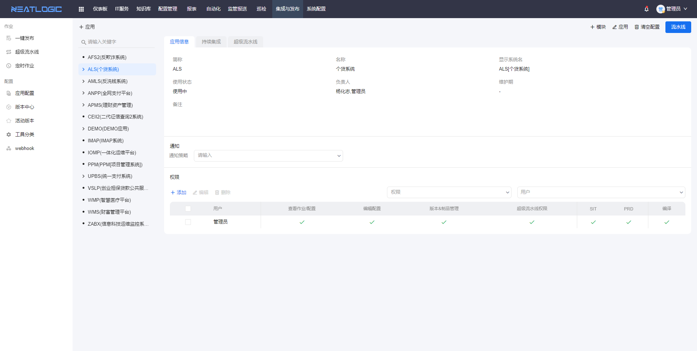
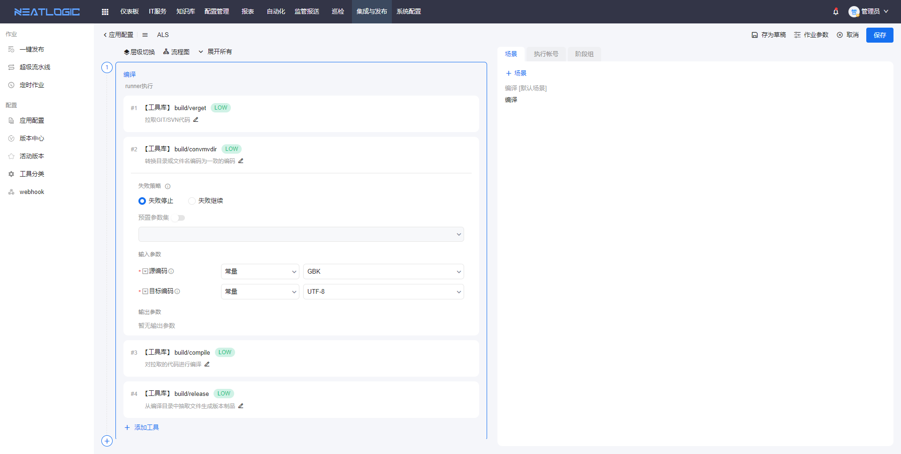
- Support configuration application continuous integration.
- Support the configuration of application super pipelines, and only the current application can be selected in the template.
- Support for configuring notification policies.
- Support managing user scope through authorization.
- Support for editing application, module, and environmental information

### Version Center

The version center is used to manage the versions and engineering materials of application modules. The compiled version of the engineering physics library supports uploading and downloading.
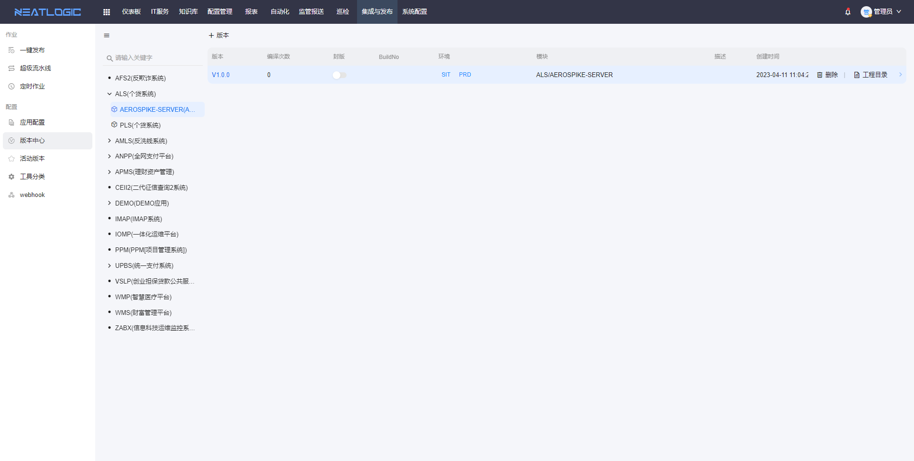
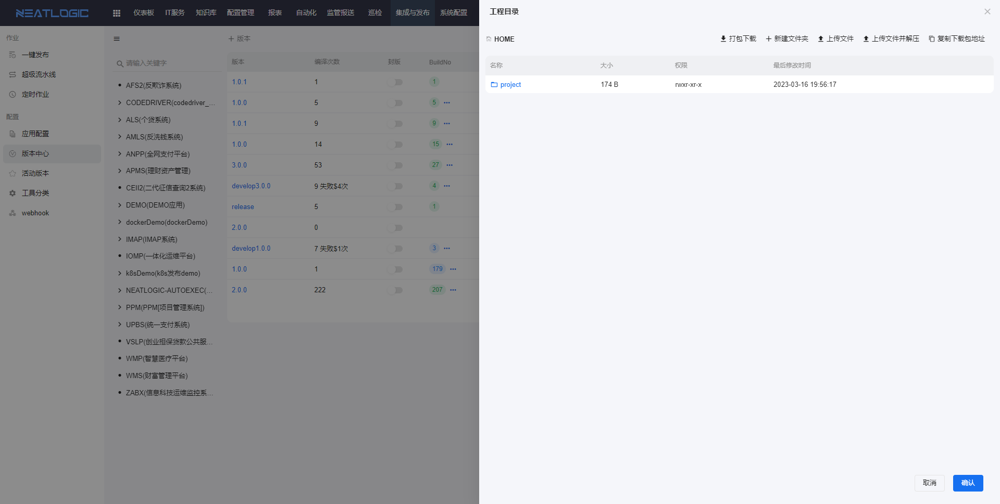

### One-click publishing

One-click publishing page supports launching single publishing jobs and launching batch jobs.
1. Initiate a single publish job 
Select the application and module that initiated the job (with a configured assembly line and environment), and then click the Add Job button to complete the configuration of initiating and publishing the job and save it.
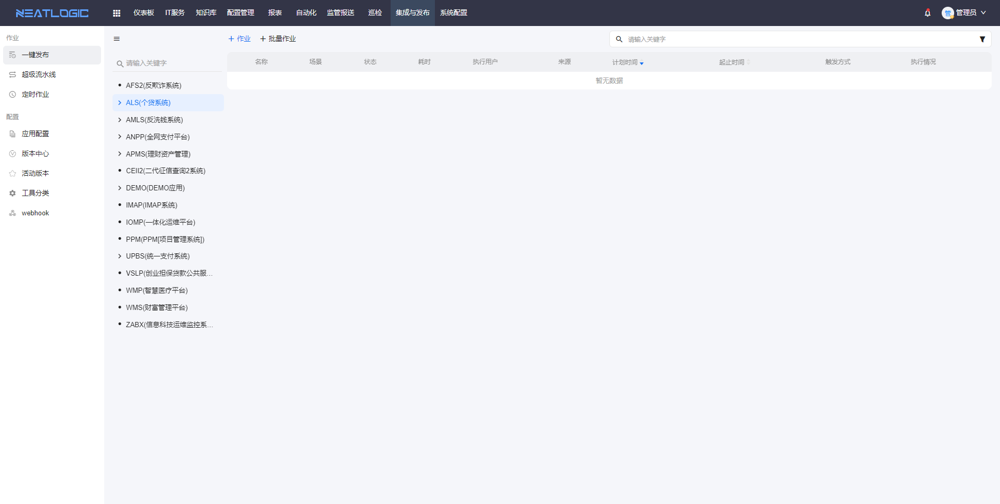
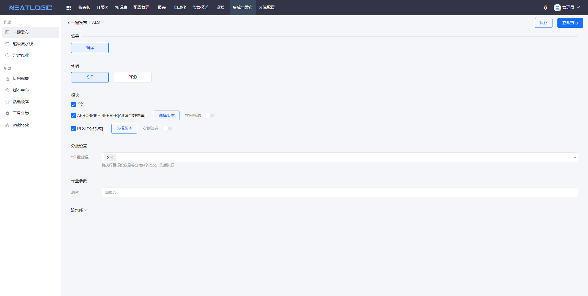
2. Batch Publish Job 
Batch publishing jobs can be created directly or initiated through a super assembly line. Direct creation refers to adding existing jobs to a collection, and the super pipeline method is initiated through templates.
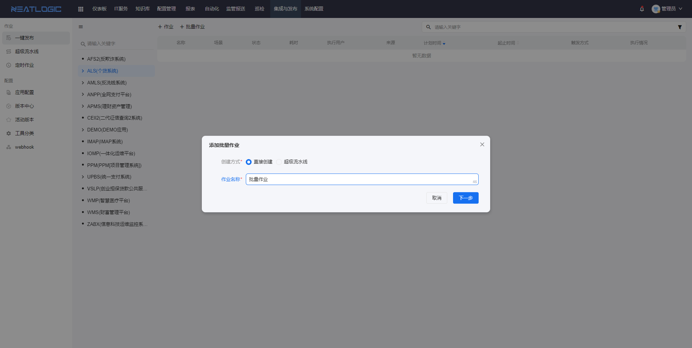
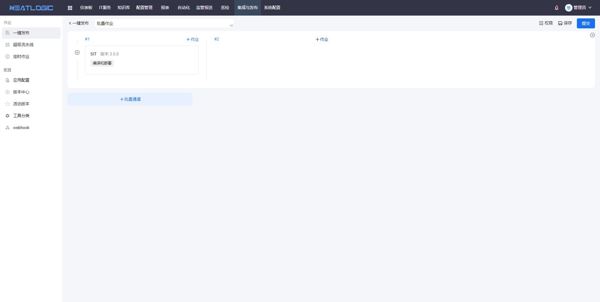
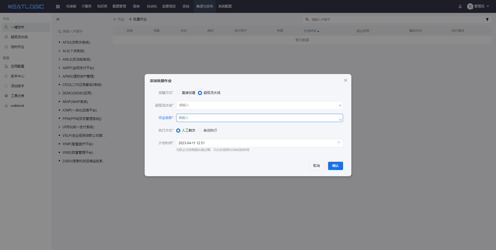

### Superpipeline

The Superpipeline manages global batch publishing job templates, and supports the initiation of batch jobs and scheduled jobs.
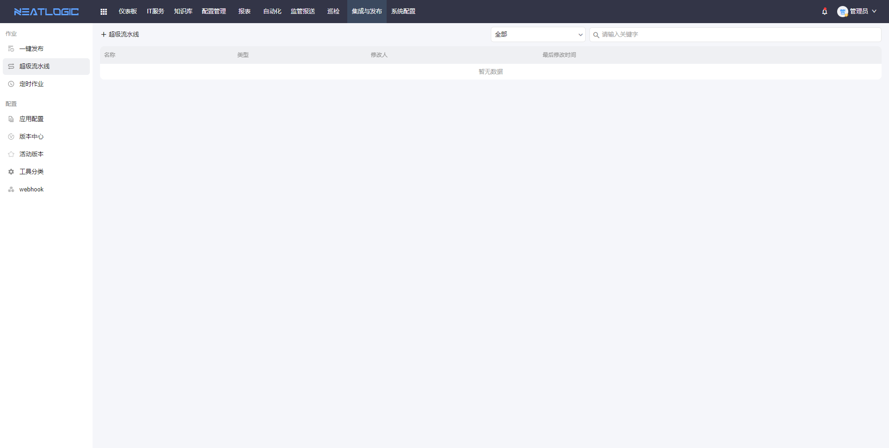
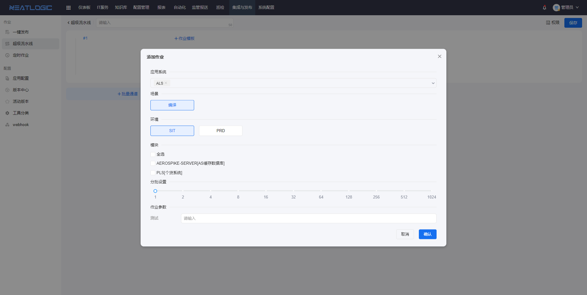

### Scheduled job

Scheduled job are initiated and published by configuring a fixed job timer, which supports two types of jobs: regular
jobs and super pipeline jobs.
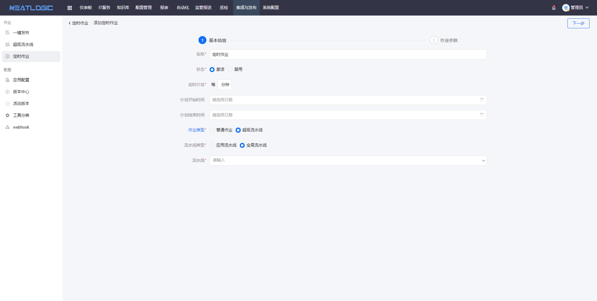

### Webhook

The webhook page is used to manage job triggers, including configuring trigger ranges and trigger actions. The trigger
range is the trigger point, and the object of the trigger range is the job state associated with the application
module's environment. The trigger action is an integrated configuration associated with the "Publish Trigger Data
Specification" type.
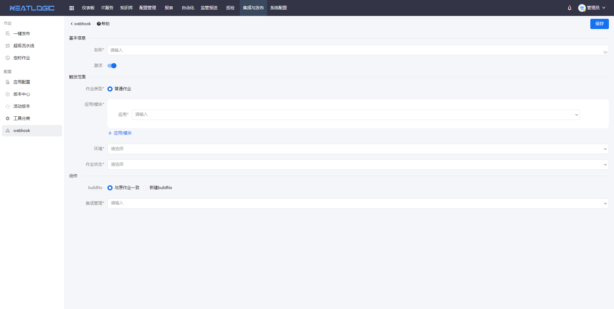

## All Features

<table border="1"><tr><td>Number</td><td>Category</td><td>Function Point</td><td>Description</td></tr><tr><td>1</td><td rowspan="5">Parameters</td><td rowspan="2">Global Parameters</td><td>Supports basic management of adding, deleting, modifying, and querying global parameters for automated jobs.</td></tr><tr><td>2</td><td>Supports global parameter fields such as text, password, date, and text area.</td></tr><tr><td>3</td><td rowspan="3">Predefined Parameters</td><td>Supports basic management of adding, deleting, modifying, and querying predefined parameters for automated jobs.</td></tr><tr><td>4</td><td>Supports predefined parameter sets based on tool libraries and atomic operations.</td></tr><tr><td>5</td><td>Supports referencing global parameters in predefined parameter sets.</td></tr><tr><td>6</td><td rowspan="5">Categories</td><td rowspan="3">Tool Categories</td><td>Supports basic management of adding, deleting, modifying, and querying tool categories.</td></tr><tr><td>7</td><td>Supports viewing the statistics of tool libraries, custom atomic operations, and associated orchestrations under a category.</td></tr><tr><td>8</td><td>Supports setting tool library permissions based on types.</td></tr><tr><td>9</td><td rowspan="2">Tool Directory</td><td>Supports basic management of adding, deleting, modifying, and querying tool directories.</td></tr><tr><td>10</td><td>Supports setting permissions for tool libraries based on directories.</td></tr><tr><td>11</td><td rowspan="3">Scenes</td><td rowspan="3">Orchestration Scenes</td><td>Supports basic management of adding, deleting, modifying, and querying automation scenes.</td></tr><tr><td>12</td><td>Supports defining automation scene categories based on types, scenes, and job positions.</td></tr><tr><td>13</td><td>Supports setting different usage scenes within a combination orchestration, where each scene represents a different execution phase in the orchestration. Scenes can meet the requirements of multiple usage scenarios in one orchestration.</td></tr><tr><td>14</td><td rowspan="15">Tool Library</td><td rowspan="4">Built-in Tool Libraries</td><td>In addition to commonly used basic tool libraries, it also includes file operations, configuration backup, SQL execution, service start/stop, WebSphere deployment plugins, K8s deployment plugins, Docker deployment plugins, WebLogic deployment plugins, etc.</td></tr><tr><td>15</td><td>Supports online testing of built-in tools.</td></tr><tr><td>16</td><td>Supports online help for built-in tool libraries, including input parameters, output parameters, execution methods, risk levels, etc.</td></tr><tr><td>17</td><td>Supports associating built-in tool libraries with custom display templates.</td></tr><tr><td>18</td><td rowspan="11">Custom Atomic Operations</td><td>Supports common scripting languages, including Python, Ruby, VBScript, Perl, PowerShell, CMD, Bash, csh, ksh, sh, JavaScript.</td></tr><tr><td>19</td><td>Supports various input and output parameter types, including text, text area, password, file, time, date, single choice, multiple choice, switch, account, JSON object, node information. Parameters can be set with default values.</td></tr><tr><td>20</td><td>Supports command-line parameters and can specify the number of command-line parameters.</td></tr><tr><td>21</td><td>Supports setting risk levels for custom tools.</td></tr><tr><td>22</td><td>Supports binding custom tools to tool directories.</td></tr><tr><td>23</td><td>Supports version control based on Git and importing/exporting atomic operations from/to Git.</td></tr><tr><td>24</td><td>Supports version review and release for custom tools.</td></tr><tr><td>25</td><td>Supports common connection protocols such as SSH, WinRM, Tagent, IPMI, HTTP, HTTPS, Telnet, SNMP, SMI, etc.</td></tr><tr><td>26</td><td>Supports connection methods such as remote target machine execution, local execution, and local-to-remote execution.</td></tr><tr><td>27</td><td>Supports online testing and verification of custom atomic operations.</td></tr><tr><td>28</td><td>Supports import and export of atomic operations for environment migration between different environments.</td></tr><tr><td>29</td><td rowspan="35">Release Management</td><td rowspan="2">Release Templates</td><td>Supports defining templates for specific types of releases, such as WebLogic release, to quickly complete release configuration by selecting the corresponding template when configuring a specific instance.</td></tr><tr><td>30</td><td>Supports template configuration for regular single-instance and clustered deployments, such as WebLogic application updates.</td></tr><tr><td>31</td><td rowspan="9">Release Configuration</td><td>Supports basic management of combining release templates.</td></tr><tr><td>32</td><td>Supports custom scene-based release orchestration, supports graphical drag-and-drop layout design.</td></tr><tr><td>33</td><td>Supports copying existing release combinations for creating new similar combinations.</td></tr><tr><td>34</td><td>Supports customizing stages or stage groups for tools within a release combination orchestration. Tools within a stage can be executed in serial, parallel, or conditionally.</td></tr><tr><td>35</td><td>Supports full, batch, and gray execution strategies for tools within a release combination orchestration stage.</td></tr><tr><td>36</td><td>Supports adding, editing, and deleting basic playbooks. Basic playbooks can be authorized to be called at specific levels, including visibility at the subsystem level, environment level, and instance level.</td></tr><tr><td>37</td><td>Allows direct invocation of orchestration tool libraries and custom atomic operations within orchestration playbooks, simplifying the design process of playbooks.</td></tr><tr><td>38</td><td>Supports orchestration of playbooks at the subsystem, system environment, and release instance levels, enabling orchestration of multiple playbooks, and quick execution, addition, modification, and other operations of playbooks.</td></tr><tr><td>39</td><td>Same playbooks can be inherited and reused between different management units, and the priority order is as follows: application instance level, subsystem environment level, subsystem level.</td></tr><tr><td>40</td><td>Scene Presets</td><td>Supports preselecting settings for releases within a system based on scenes, such as compile-only, build, backup, rollback, SQL execution, application start/stop, etc.</td></tr><tr><td>41</td><td rowspan="7">Compile & Build</td><td>Supports automated compilation, packaging, and automatic deployment of application code starting from SVN or Git code repositories. It also supports automatic execution and deployment of database scripts and application configuration files obtained from SVN.</td></tr><tr><td>42</td><td>Supports automatic maintenance of code baselines, automatically merging modifications from the baseline to the release branch after deployment, and automatically merging modifications from the baseline to the deployment branch before compilation.</td></tr><tr><td>43</td><td>Supports extraction and display of JUnit test result data.</td></tr><tr><td>44</td><td>Supports integration with SonarQube code scanning and provides scanning result list.</td></tr><tr><td>45</td><td>Provides version locking functionality. After locking, only authorized users can compile the code again to prevent untested code changes before production release.</td></tr><tr><td>46</td><td>Supports automatic compilation and packaging of Java applications using tools such as Maven, Ant, Gradle; supports automated compilation and packaging of .Net, C, VC++, Java applications; also supports custom script design for compilation and packaging to accomplish custom compilation and packaging of applications.</td></tr><tr><td>47</td><td>For completed applications after compilation, the platform supports material organization based on custom needs and re-completes automated packaging of the organized materials.</td></tr><tr><td>48</td><td rowspan="2">Configuration Modification/Replacement</td><td>Supports automated deployment of application configuration files, including automated modification and replacement of configuration files.</td></tr><tr><td>49</td><td>Supports automatic configuration for server-specific differences, supports configuration template functionality, and combines configuration templates with environment configuration to generate final configuration files that can adapt to different environments (e.g., SIT, UAT, PRD).</td></tr><tr><td>50</td><td rowspan="6">Database Script Auto Execution</td><td>Automatically identifies the target and execution sequence of DB scripts based on certain rules and runs them in serial or parallel. Users can choose to commit or roll back when errors occur. Operations are reentrant, and successfully executed scripts will not be executed again. The platform can automatically detect modified DB scripts and provide prompts. DB script execution is supported using MySql client, Oracle SQLPlus, db2cli-compatible execution methods, allowing DB scripts that can be run in the above-mentioned tools to be executed directly in the deployment tool.</td></tr><tr><td>51</td><td>When there is an error in the execution of database scripts, the platform page supports user interaction, and users can choose to submit or roll back. Supports real-time display of rollback/commit transactions, and supports color marking of keywords and their corresponding lines.</td></tr><tr><td>52</td><td>Supports one-click publishing of multiple DB scripts without input and explanations; supports selecting and executing multiple DB scripts.</td></tr><tr><td>53</td><td>DB script operations are reentrant, and successfully executed scripts will not be repeated. The platform can automatically detect modified database scripts and provide prompts.</td></tr><tr><td>54</td><td>Supports rollback of database scripts, clearly lists rollback script list, and allows interactive rollback operations. Rollback script operations are reentrant, and successfully executed scripts cannot be repeated.</td></tr><tr><td>55</td><td>Checks and recompiles invalid objects for Oracle databases.</td></tr><tr><td>56</td><td rowspan="8">Deployment & Publishing</td><td>Supports automated deployment of applications on Linux, Unix, Windows, and other systems.</td></tr><tr><td>57</td><td>Supports built-in deployment plugins, including Tomcat, WebLogic, and WAS, and supports extension.</td></tr><tr><td>58</td><td>Supports one-click batch deployment of applications, where multiple system versions can be released at once. The priority of application systems should be considered. During the release process, operations in the batch release can be paused, rerun, etc., and already fixed operations can be re-released.</td></tr><tr><td>59</td><td>Real-time display of the status of each release process is required for both automated deployment of a single application and one-click deployment of multiple applications.</td></tr><tr><td>60</td><td>Supports application version rollback, and the platform can quickly select any historical version for rollback.</td></tr><tr><td>61</td><td>Supports monitoring the status of application instances. After version release, the platform can easily detect and view the health status of application instances.</td></tr><tr><td>62</td><td>Supports application restart. Multiple instances of the application can be started and stopped in parallel or sequentially. Independent authorization management is provided, which can be granted to specific users, enabling users to deploy the platform to restart applications and view logs automatically.</td></tr><tr><td>63</td><td>Supports completeness and version consistency verification of materials to be released, supports automatic scanning of database scripts.</td></tr><tr><td>64</td><td rowspan="4">Code Management</td><td rowspan="4">Code Management</td><td>Supports checking if version branches (integration branches) have merged code changes from the code baseline (master) before compilation.</td></tr><tr><td>65</td><td>After production release and successful verification, automatically triggers the merging of corresponding versions of code back to the baseline (master).</td></tr><tr><td>66</td><td>Supports triggering automatic compilation of versions and automatic deployment to the SIT environment by setting Git or SVN hooks, and allows viewing relevant descriptions of code changes corresponding to the compilation.</td></tr><tr><td>67</td><td>Supports automatic tagging of code branches.</td></tr><tr><td>68</td><td rowspan="4">Version Center</td><td rowspan="2">Artifact Management</td><td>Supports built-in application version artifact management, and production can obtain versions from its own artifacts.</td></tr><tr><td>69</td><td>Supports integration with third-party version artifact repositories such as Nexus.</td></tr><tr><td>70</td><td rowspan="2">Version Management</td><td>Supports archiving of released version codes, SQL, configuration files.</td></tr><tr><td>71</td><td>Supports version definition, version open/close operations.</td></tr><tr><td>72</td><td rowspan="17">Version Publishing</td><td rowspan="6">Batch Publishing</td><td>Supports defining batch publishing orchestration based on release pipelines and release jobs.</td></tr><tr><td>73</td><td>Supports batch execution of multiple jobs. Within the same batch, multiple release jobs can be orchestrated in serial or parallel based on the logical relationship between applications. Users can complete the batch execution of all jobs with a single button.</td></tr><tr><td>74</td><td>Supports lane definition and configuration for tasks in batch publishing.</td></tr><tr><td>75</td><td>Supports task status policies in batch publishing, such as continuing on failure, waiting strategies, etc.</td></tr><tr><td>76</td><td></td></tr><tr><td>77</td><td>Supports batch publishing authorization configuration.</td></tr><tr><td>78</td><td rowspan="11">One-Click Publishing</td><td>Supports viewing the release list from an application perspective and provides quick search functionality to quickly find configurations of application systems or modules.</td></tr><tr><td>79</td><td>Supports release rollback.</td></tr><tr><td>80</td><td>Supports execution based on scene or full release configuration.</td></tr><tr><td>81</td><td>Allows selective execution of specific steps in existing automated deployment processes.</td></tr><tr><td>82</td><td>Supports outer loop execution of multiple operational playbooks based on application server instances. DB scripts can be executed within a specific loop.</td></tr><tr><td>83</td><td>Supports scheduled execution of job tasks. The platform supports regular and periodic job execution, automatically creating and running jobs based on defined trigger rules, facilitating the automatic deployment of the test environment.</td></tr><tr><td>84</td><td>Supports viewing application logs. Users can view and download application log files in real time within the automated deployment platform.</td></tr><tr><td>85</td><td>Supports white-box release, where every action during the release process should be displayed in real-time scrolling logs.</td></tr><tr><td>86</td><td>Supports viewing operation log records during the release process. Each release step should have log information, including but not limited to operator, operation time, and duration. The operation logs can be exported for auditing purposes.</td></tr><tr><td>87</td><td>Supports real-time scrolling printout of release logs. For applications with asynchronous startup, the log can be tailed in real-time until the application startup is completed.</td></tr><tr><td>88</td><td>All status logs displayed in real-time should be differentiated by different colors to distinguish error messages, warning messages, and normal messages, facilitating user identification.</td></tr></table>